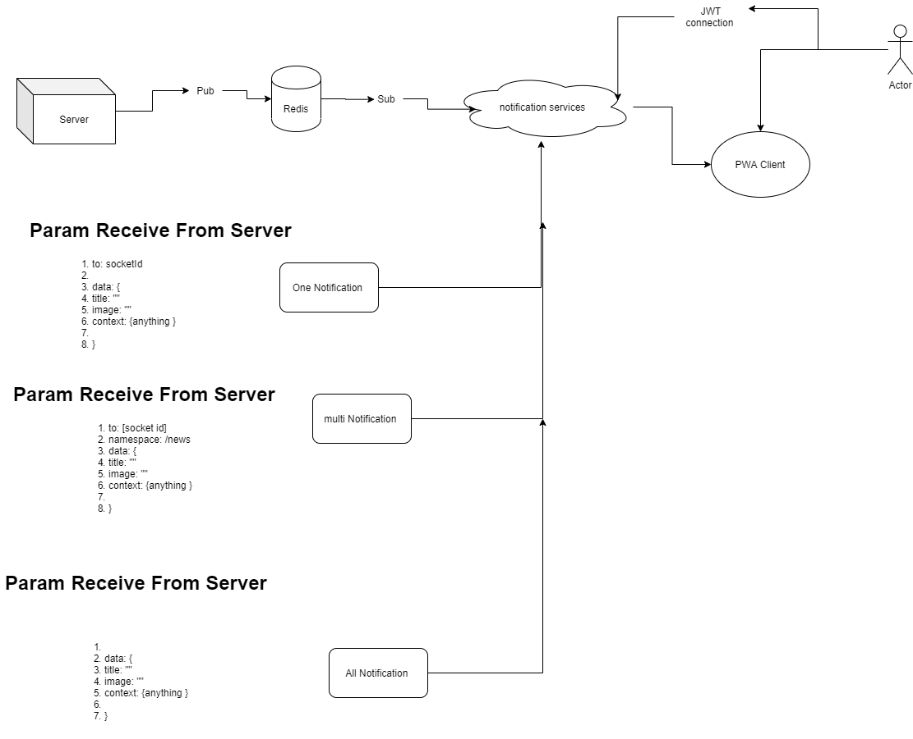

# Socket Messaging System



# config

1. node: 8.10
2. npm: 6
3. express: 4.16
4. socketio: 2.3
5. redis: 3.0
6. jwt: 8.5
7. eslint

# Features

1. one to one mssaging.
2. one to multi messaging.
3. one to all messaging.
4. smart caching with redis.
5. dynamic expiration of messages.
6. works if user is'nt online.
7. works if user have multiple offline messages.

# How it works

## one to one

   1. user is online ? send the message
   2. user is offline ?\
   first: save the message.\
   second: create a list of messages Key for
   that pop when user onlines and finally
   the list will removed.

## one to multi

   1. send message to all online users.
   2. save the message.
   3. find offline receivers ( message to list subtract online sended )
   4. push messageKey in offline box of user\
   note : the saved message persist in redis until expires.

## one to all

 1. save the message.
 2. scan the all online users.\
 note: scan return an array that
 first index: stands for next scan calling cursor
 second index: stands for list of keys.
 3. for all online sockets send the s2a.\
 note: check for prevent duplicate sending
 for this purpose after s2a for a user,
 a set with key:\
  ```messageKey + redisNsp.sent + "/" + socketId```\
 will occurs.
 4. save the s2a message to global s2a list.\
 note : expiration added to first stage not the list.

## Change Logs

## BUGS

## Authors

1. Mojtaba HosseinPour.
  